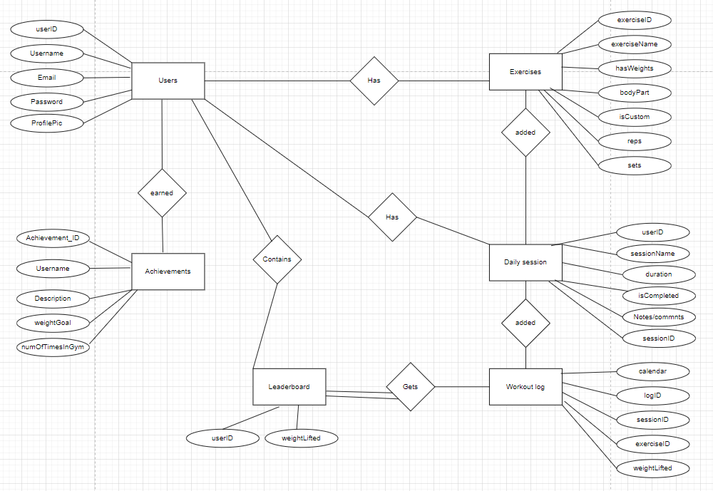
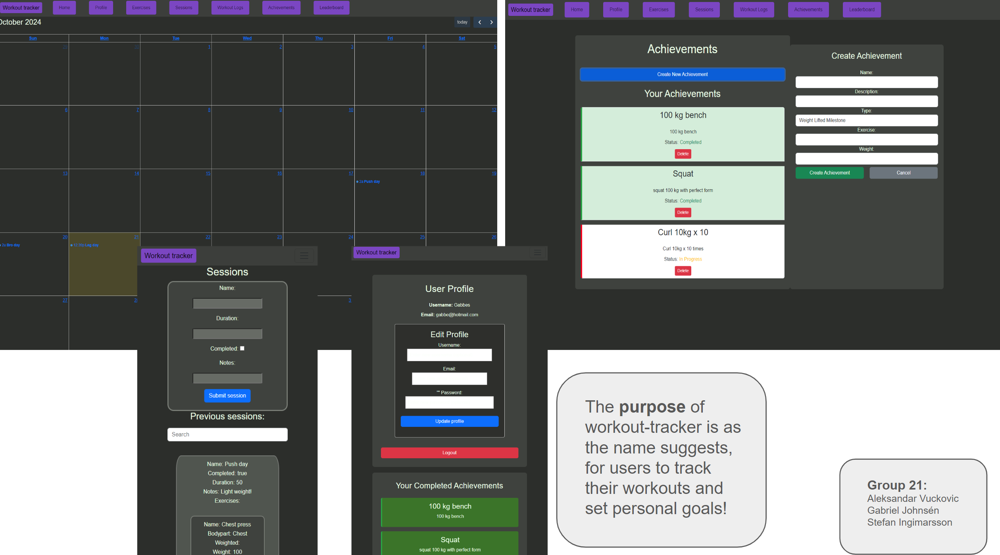

# Backend and Frontend Template

Latest version: https://git.chalmers.se/courses/dit342/group-00-web

This template refers to itself as `group-00-web`. In your project, use your group number in place of `00`.

## Project Structure

| File                                                 | Purpose                     | What you do?                             |
| ---------------------------------------------------- | --------------------------- | ---------------------------------------- |
| `server/`                                            | Backend server code         | All your server code                     |
| [server/README.md](server/README.md)                 | Everything about the server | **READ ME** carefully!                   |
| `client/`                                            | Frontend client code        | All your client code                     |
| [client/README.md](client/README.md)                 | Everything about the client | **READ ME** carefully!                   |
| [docs/LOCAL_DEPLOYMENT.md](docs/LOCAL_DEPLOYMENT.md) | Local production deployment | Deploy your app local in production mode |

## Requirements

The version numbers in brackets indicate the tested versions but feel free to use more recent versions.
You can also use alternative tools if you know how to configure them (e.g., Firefox instead of Chrome).

- [Git](https://git-scm.com/) (v2) => [installation instructions](https://www.atlassian.com/git/tutorials/install-git)
  - [Add your Git username and set your email](https://docs.gitlab.com/ce/gitlab-basics/start-using-git.html#add-your-git-username-and-set-your-email)
    - `git config --global user.name "YOUR_USERNAME"` => check `git config --global user.name`
    - `git config --global user.email "email@example.com"` => check `git config --global user.email`
  - > **Windows users**: We recommend to use the [Git Bash](https://www.atlassian.com/git/tutorials/git-bash) shell from your Git installation or the Bash shell from the [Windows Subsystem for Linux](https://docs.microsoft.com/en-us/windows/wsl/install-win10) to run all shell commands for this project.
- [Chalmers GitLab](https://git.chalmers.se/) => Login with your **Chalmers CID** choosing "Sign in with" **Chalmers Login**. (contact [support@chalmers.se](mailto:support@chalmers.se) if you don't have one)
  - DIT342 course group: https://git.chalmers.se/courses/dit342
  - [Setup SSH key with Gitlab](https://docs.gitlab.com/ee/ssh/)
    - Create an SSH key pair `ssh-keygen -t ed25519 -C "email@example.com"` (skip if you already have one)
    - Add your public SSH key to your Gitlab profile under https://git.chalmers.se/profile/keys
    - Make sure the email you use to commit is registered under https://git.chalmers.se/profile/emails
  - Checkout the [Backend-Frontend](https://git.chalmers.se/courses/dit342/group-00-web) template `git clone git@git.chalmers.se:courses/dit342/group-00-web.git`
- [Server Requirements](./server/README.md#Requirements)
- [Client Requirements](./client/README.md#Requirements)

## Getting started

```bash
# Clone repository
git clone git@git.chalmers.se:courses/dit342/group-00-web.git

# Change into the directory
cd group-00-web

# Setup backend
cd server && npm install
npm run dev

# Setup frontend
cd client && npm install
npm run serve
```

> Check out the detailed instructions for [backend](./server/README.md) and [frontend](./client/README.md).

## Visual Studio Code (VSCode)

Open the `server` and `client` in separate VSCode workspaces or open the combined [backend-frontend.code-workspace](./backend-frontend.code-workspace). Otherwise, workspace-specific settings don't work properly.

## System Definition (MS0)

### Purpose

This project is a workout tracking application that allows users to log their exercises and track progress. Users can define their own exercises or choose from already
predefined ones. The project also features a leaderbord and achievement system to encourage user engagement.


#### Key features

- Use management (userID, username, email, password, profile picture)
- Predefined custom exercises
- Daily workout session tracking
- Achiement system based on performance and attendance
- Leaderbord displaying top users by strength
- Workout log with calender for past sessions


#### ER description

##### User attributes
  - userID: Unique identifier for each user
  - username: Users displayname
  - email: Email address of user
  - password: Users encrypted password
  - profilePic: Users optional profile picture
**User Functionality**:
  - Able to add predefined exercises to workout regimen
  - Able to add custom exercises to workout regimen
  - Track daily session
  - Monitor progress over time

##### Exercises attributes
  - exerciseID: Unique identifier for each exercise
  - exerciseName: Name of exercise
  - hasWeight: Boolean indicating if weight is used
  - bodyPart: The bodypart the exercise primarily focuses on
  - isCustom: Boolean indicating if it is a custom exercise
  - reps: Number of repetitions
  - sets: Number of sets
**Exercise functionality**
  - A user can browse predefined exercises
  - A user can create their own custom exercise
  - A user can add an exercise to a daily session

##### Daily sessions attributes
  - sessionID: Unique identifier for a session
  - exerciseID: Foreign key linking the exercise        (Moved exercise ID to daily session instead of workout log)
  - userID: Foreign key linking user
  - sessionName: Name of the session
  - duaration: Total time that the session took
  - isCompleted: Boolean indicating if the session was completed
  - notesOrComments: Additional details about the session
**Daily session functionality**
  - A user can create, update and track a daily session
  - A session is stored in the users log for future reference

##### Workout log attributes 
  - logID: Unique identifier for a workout log
  - sessionID: Foreign key linking the session
  - calendar: A visual representation of the workout history
  - weightLifted: Displays the total weight lifted            (total weight lifter in a set of exercises maybe?)                              
**Workout log functionality**
  - Stores a users sessions in a log
  - A user can view, update and edit past, current and future sessions
  - The log will be represeted in a calendar format where the sessionName will be displayed as an overview in the calendar

##### Achievement attributes
  - achievementID: Unique identifier for an achievement
  - userID: Foreign key linking an achievement to a user                                (linking with userID instead of username?)
  - numOfTimesInGym: Foreign key linking workout log and the number of entries there to achievements
  - exerciseMilestone: Foreign key pointing to a milestone in a certain exercise       (changed from weightGOal to exerciseMilestone maybe?)
  - description: Achievement details 
**Achievement functionality**
  - A user can earn achievements based on personal performance such as a new personal record in a given exercise
  - A user can earn achievements based on reaching a gym visit milestone

##### Leaderbord attributes
  - userID: Foreign key linking to a user
  - weightLifted: Foreign key linking to the workoutlog
**Leaderbord functionality**
  - Displays the strongest user
  - Retrieves data from the workout log to update user ranks


### Pages

- **Login Page**
  - **Description**: Users can log in with their email and password
- **Home Page**
  - **Description**: Contains paths (buttons) for all other pages.
- **Profile Page**
  - **Desription**: Users can change information and upload a profile picture.
- **Exercise Page**
  - **Description**: Users can browse and create new exercises.
- **Sessions Page**
  - **Description**: Users can browse and create new sessions.
- **Workout log page**
  - **Description**: Users can browse a calendar of sessions and edit past sessions.
- **Achievement page**
  - **Description**: Users can browse achievements and requirements.
- **Leaderbord page**
  - **Description**: Users can see the top strongest users.


### Entity-Relationship (ER) Diagram



## Teaser (MS3)



A few sentences
In the diagram we have defined the user. The user has an ID, username, email, password and a profile picture. The user has a list of predefined exercises that they can add to their workout regiment. The user will also have the choice to add their own exercises if they are not already listed. Each exercise has their own ID, name, a boolean that tells if the user uses weights or not for the exercise, how many reps and how many sets the user performs, which body part the exercise targets, and a boolean that tells whether the user has added the exercise themselves or if it's a predefined exercise.

Each desired exercise can be added to a daily session. The user will be able to create different sessions for different days, e.g. chest day, back day etc. The daily session has a foreign key userID, session name, duration, boolean isCompleted, notes/comments, and the session ID. The sessions will be stored in the users log, where the user will be able to look back at previous exercises. The log will contain a calendar and a log ID.

The user will also be able to get achievements based on their efforts in the gym. The achievements have an ID, description, and foreign key username that points to the user, foreign key weightGoal that points to how much weight the user can lift, and foreign key numOfTimesInGym which points at the workout logs and the number of entries there. The achievement will be triggered once the user sets a new personal record in weightlifting and when the user has visited the gym a substantial amount of times.

The leaderboard will display the top strongest users. We will fetch the weights from the workout log, and the userID from the users.

Pages:

Login page: Users can log in using email and password.
Home page: Contains paths (buttons) for all other pages.
Profile page: Users can change information and upload a profile picture.
Exercise page: Users can browse and create new exercises.
Sessions page: Users can browse and create new sessions.
Workout log page: Users can browse a calendar of sessions and edit past sessions.
Achievement page: Users can browse achievements and requirements.  
Leaderboard page: Users can see the top strongest users.
